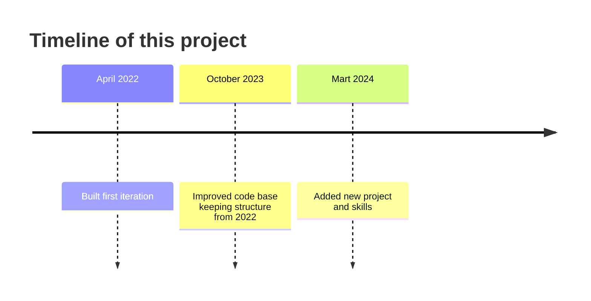

Welcome to my personal portfolio! This project is a showcase of my skills, projects, and education, built using TypeScript, React, and SCSS. Feel free to explore and get to know more about me.

Getting Started

To run this project locally, follow these steps:

1. Clone the repository:
   `git clone git@github.com:RinalinDS/portfolio.git`

2. Install dependencies:

`cd portfolio`
`yarn install` / `npm install`

3. Start the development server:

bash

    yarn start

OR

     npm start

The portfolio will be accessible at http://localhost:3000 by default.

Features

    Biography: Learn more about me and my background.
    Skills: View a list of my technical skills.
    Projects: Explore the various projects I have worked on.
    Education: See details about my educational background.
    Socials: Connect with me on different social platforms.

Technologies Used

    TypeScript
    React
    SCSS

## Published [here](https://rinalinds.github.io/portfolio/).
